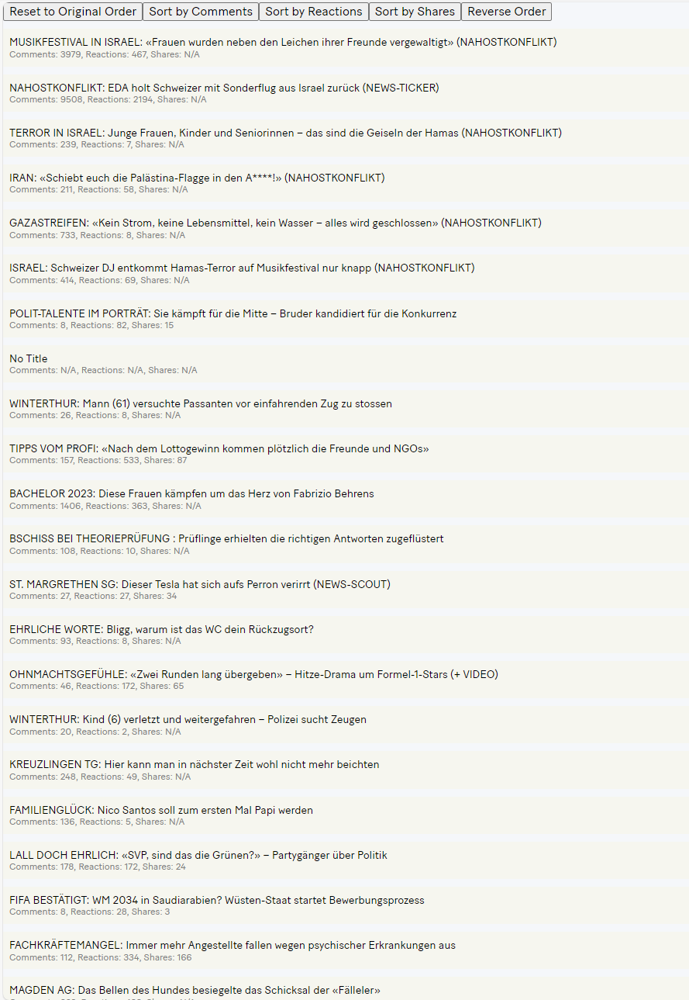
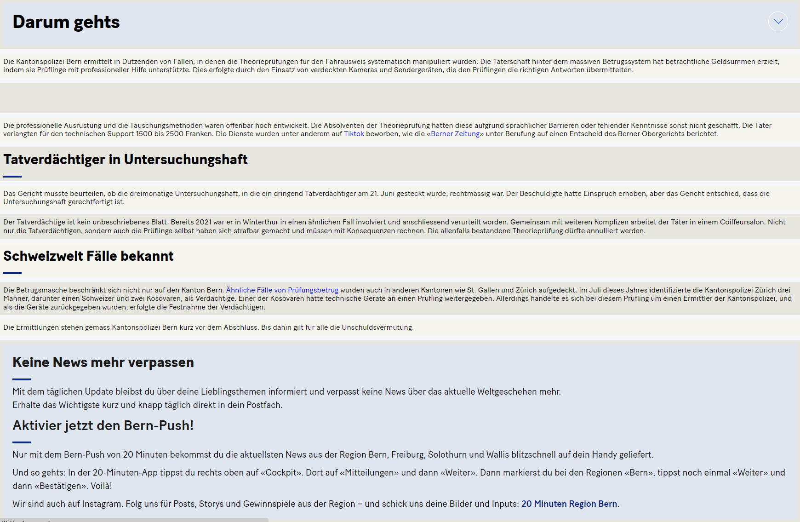

# 20sec
 Read 20min.ch in 20sec with a clutter free Hackernews theme
 
 
 
 
 
# Install
 1. Open Chrome, Edge or any Chromium based browser
 2. Go to "Manage Extensions"
 3. Activate Developer Mode
 4. Click "Load unpacked extension"
 5. Select the /chrome-extension/ folder of this project
 
# How to use
 1. Open www.20min.ch
 2. Click onto the extension and click the "Turn On" button
 3. Click an article title to read it
 
# Limitations / Bugs

 - Paragraphs too wide:
   On desktop the story paragraphs are wide, which is not reader friendly
   
 - Images / Videos not displayed correctly:
   Images are too large, Videos don't play

 - Turn On/Off cumbersome:
   You have to click onto the extension icon 2x (close and open the Menu) to change the "Turn Off" or "Turn On" button

 - No lazy loading:
   The home page of 20min.ch uses lazy loading and only articles already loaded before enabling the extension will be displayed

 - No comments

 - No videos

 - No reactions